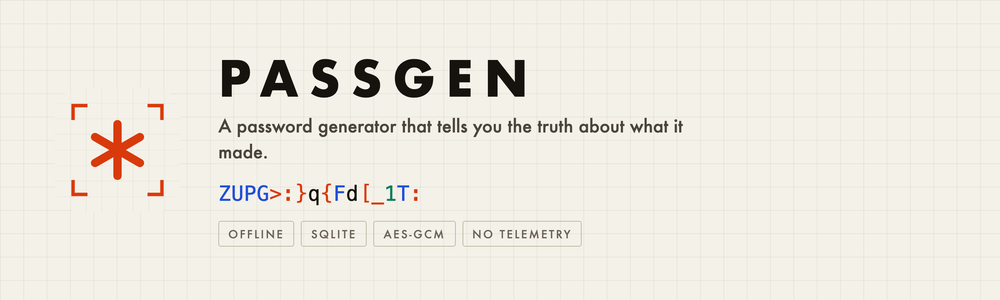
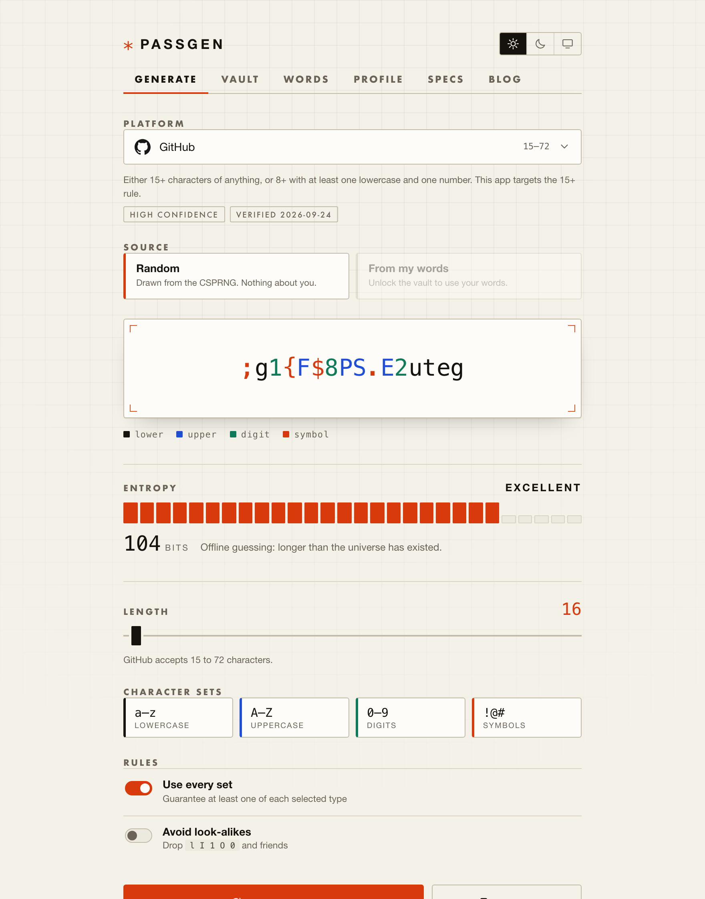
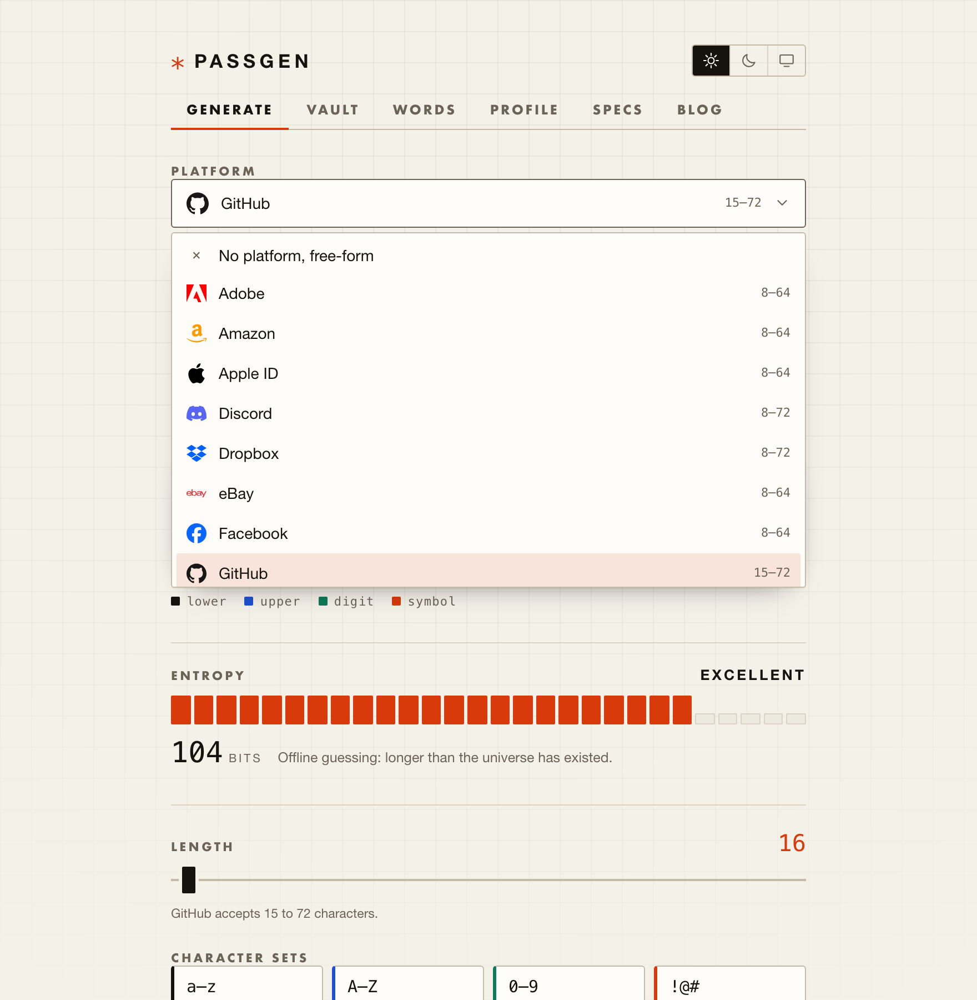
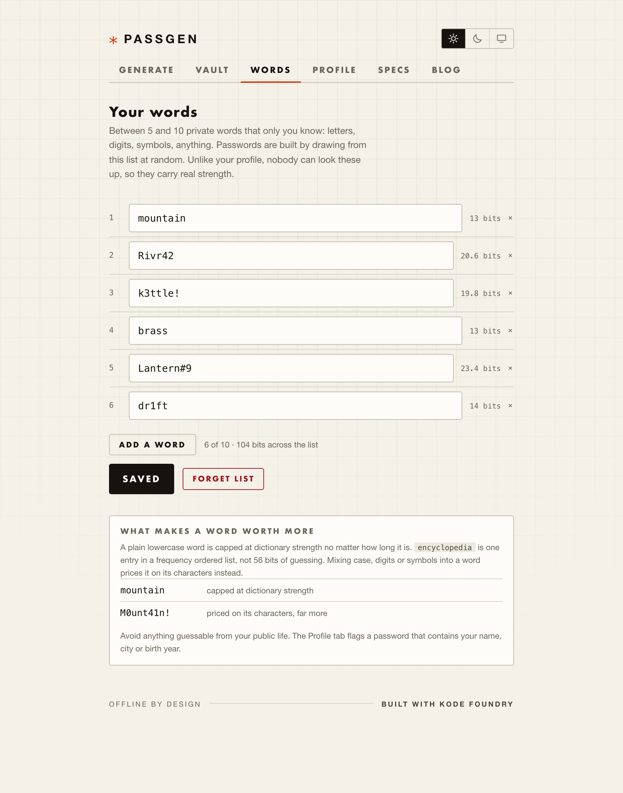
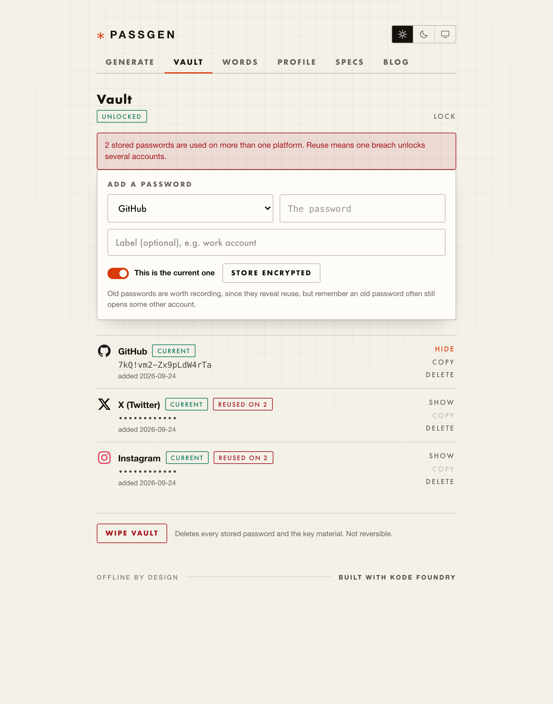
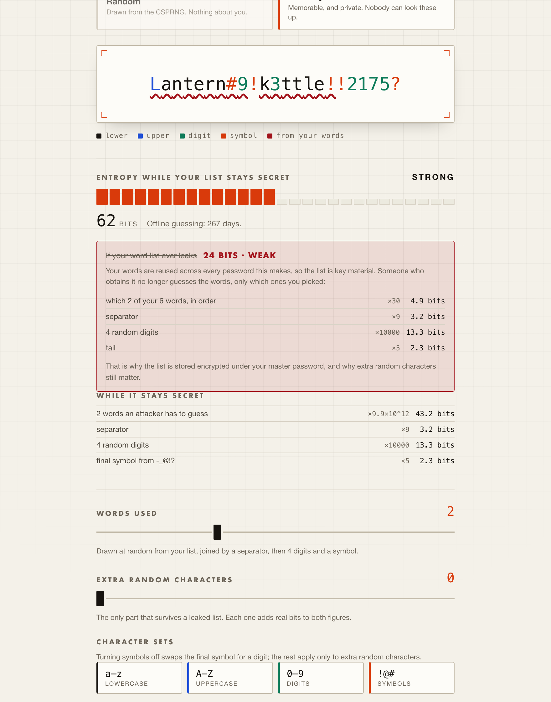
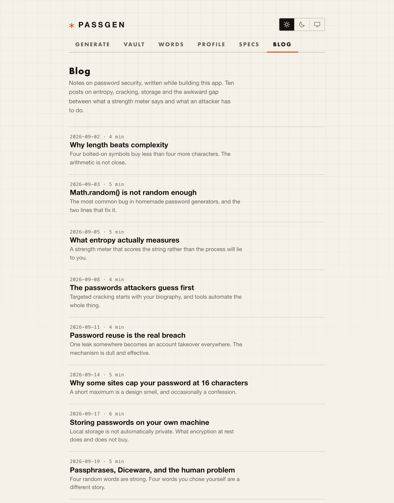
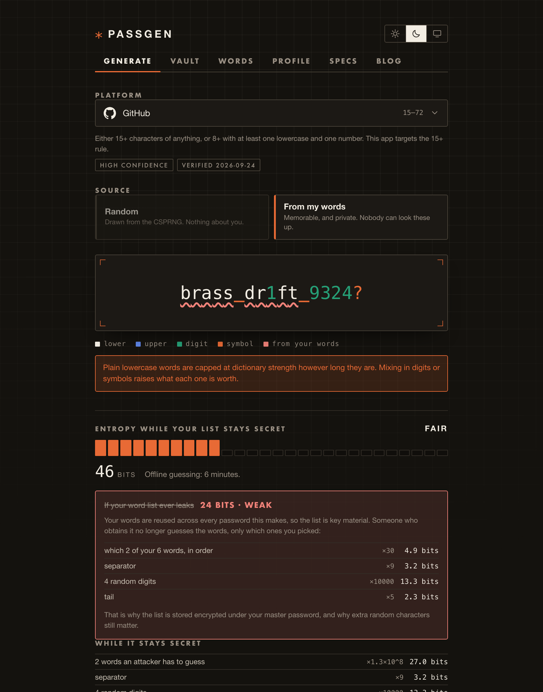

<p align="center">
  
</p>

<p align="center">
  <strong>A password generator that tells you the truth about what it made.</strong>
</p>

<p align="center">
  
  
  
  
  
  
</p>

---

Most strength meters measure the wrong thing. They count the characters in front of
them and report a big number, which is fine right up until the password was built
from something an attacker can guess.

PassGen measures the process instead of the string. When a password comes from your
own private words, it shows you what that actually costs someone trying to break it,
and what it would still cost if your word list ever leaked. When those two numbers
disagree, you get to see both.

Everything runs in the browser. No account, no server, no network calls of any kind.

<p align="center">
  
</p>

## What it does

**Generates passwords that platforms actually accept.** A catalogue of 27 services
with their real rules: minimum and maximum length, required character classes,
restricted symbol sets, repeated character limits. Pick GitHub and the length floor
jumps to 15. Pick PayPal and it caps at 20 and narrows the symbols. A test asserts
that every built in spec produces a password that spec would itself accept.

<p align="center">
  
</p>

**Uses a real CSPRNG, correctly.** `crypto.getRandomValues` with rejection sampling,
because `random % poolSize` is biased whenever the pool does not divide evenly into
2^32. Fisher-Yates for the shuffle, so guaranteed characters are not positionally
predictable.

**Colours each character by class.** Lowercase, uppercase, digit, symbol. It makes a
long password readable when you have to type it by hand. The three accent hues were
checked for colour vision deficiency separation against their own surface in both
themes, and every class is labelled in text as well, so nothing depends on colour
alone.

**Builds memorable passwords from words only you know.** Five to ten private words,
letters or digits or symbols, drawn at random and combined with digits and a symbol
tail.

<p align="center">
  
</p>

Each word is priced live, the way a rule based cracker would price it. A plain
lowercase word is capped at the strength of a frequency ordered wordlist however long
it is, because `encyclopedia` is one entry in a list, not 56 bits of guessing. Mixing
case, digits or symbols in prices it on its characters instead.

**Stores passwords encrypted, and spots reuse.** AES-GCM 256 with a key stretched
from your master password by PBKDF2-HMAC-SHA256 at 310,000 iterations. SQLite holds
ciphertext only. Reuse is detected by comparing unsalted hashes, so duplicates
surface without anything readable being written down.

<p align="center">
  
</p>

There is no recovery. A vault that can be opened without the master password was not
being protected by it.

## The part that makes it different

<p align="center">
  
</p>

Your words are reused across every password the list produces, which makes the list
key material. So the app reports two numbers and shows the arithmetic for both:

| | |
|---|---|
| **While your list stays secret** | 62 bits, STRONG, 267 days of offline guessing |
| **If your list ever leaks** | 24 bits, WEAK |

Once someone holds the list they stop guessing words and only guess which ones you
picked. `which 2 of your 6 words, in order` is 30 possibilities, not 10^12. That is
why the list is encrypted alongside the passwords, and why the extra random
characters slider is the only control that moves both figures.

An earlier version of this app built passwords from profile data instead: name, city,
birth date. That scored about 22 bits, because every letter in it was public. The
gap between 22 and 62 is the whole argument.

## Also included

A blog with ten posts on password security, written while building this, covering
entropy, cracking, storage, Diceware and the awkward distance between what a meter
says and what an attacker has to do.

<p align="center">
  
</p>

Light theme by default, with light, dark and system on the toggle. The choice
persists and is applied before first paint, so the palette never flashes. Dark is a
separately chosen set of steps rather than an inversion.

<p align="center">
  
</p>

## Running it

```bash
git clone https://github.com/josephhamawi/password-generator.git
cd password-generator

npm run serve     # http://localhost:8100
npm start         # same, and opens a browser
npm run build     # production bundle into www/
npm test          # 56 unit tests
```

`node_modules` is committed, so there is no install step.

### A note on Node versions

This project is on Angular 8 and webpack 4, which hashes modules with MD4. OpenSSL 3,
bundled with Node 17 and up, dropped MD4 from its default provider, so a plain
`ng serve` fails with `ERR_OSSL_EVP_UNSUPPORTED`.

`scripts/ng.js` wraps the Angular CLI and adds `--openssl-legacy-provider` when it
detects Node 17 or newer, so the commands above work on current Node with no
environment setup. The flag only affects webpack build hashing; no application code
uses MD4. Upgrading Angular is the real fix, and until then this keeps the project
runnable.

## How the pieces fit

```
src/app/
  generate/          shell: masthead, tabs, theme toggle
  panels/            generator, vault, words, profile, specs, blog
  shared/            brand logo renderer
  data/
    password-engine.ts       random generation, spec fitting, validation
    word-engine.ts           word generation and both entropy models
    platform-specs.ts        the built in rule catalogue
    platform-logos.ts        generated, do not edit by hand
    db.service.ts            SQLite schema, queries, persistence
    vault-crypto.service.ts  PBKDF2 and AES-GCM
    words.service.ts         the private list, encrypted under the vault key
    blog-posts.ts            blog content
src/theme/variables.scss     design tokens for both themes
scripts/ng.js                Angular CLI wrapper (Node 17+ workaround)
scripts/gen-logos.js         regenerates platform-logos.ts
```

**SQLite** is real SQLite, compiled to WebAssembly via
[sql.js](https://sql.js.org). The database lives in memory and is exported to
IndexedDB after every write, so IndexedDB is only a container for the file and all
querying is genuine SQL.

**Platform specs** carry a confidence rating, the date they were last verified, and a
link to the platform's own page. The app has no network and cannot check them for
you, so anything older than 180 days is flagged for review. Every field is editable,
and an edited row is never overwritten when the built in catalogue is updated. Treat
the shipped values as a starting point rather than authority.

**Brand logos** are 27 marks from [simple-icons](https://simpleicons.org), extracted
at build time into a generated file so there is no runtime dependency. Each logo is a
trademark of its owner and appears only to identify which service a password belongs
to.

## Testing

```bash
npm test
```

56 unit tests covering the generation engines, both entropy models, the spec
catalogue and the vault crypto. Several are deliberately probabilistic: one runs 400
draws against a repeated character limit, another runs every platform spec through
the generator 25 times, because the bugs worth catching here are the ones that only
show up sometimes.

## Security notes, stated plainly

- Encryption at rest protects the database file: a stolen laptop, a copied backup, a
  shared machine. It does not protect an unlocked vault on a compromised device, and
  no amount of cryptography would.
- Losing the master password means losing the vault. There is no reset.
- The per word entropy figures assume a 2048 word effective vocabulary for human
  chosen words, which is the conservative end of published estimates. If your words
  are genuinely obscure the real figure is higher, so treat the number as a floor.
- This has not been through a third party security audit.

## Contributing

Issues and pull requests are welcome. Particularly useful:

- Corrections to platform specs, with a link to the source
- Additional platforms
- Anything that makes the entropy model more honest rather than more flattering

## Credits

Built with [Kode Foundry](https://kodefoundry.com).

Icon shapes from [simple-icons](https://simpleicons.org) (CC0). SQLite in the browser
via [sql.js](https://sql.js.org). Built on [Ionic](https://ionicframework.com) and
[Angular](https://angular.io).
